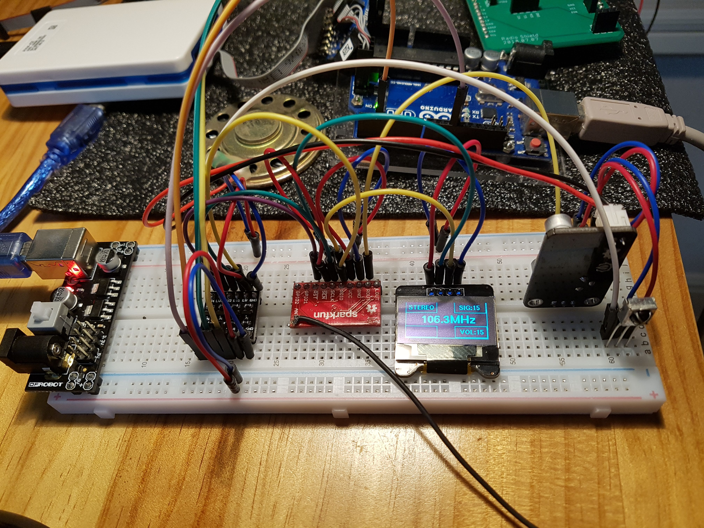

# AVR_SI4703_OLED_IrReciever
AVR library for SI4703 + OLED + IrReceiver 

[Tutorial] 
https://blog.naver.com/eziya76/221297629619 
https://blog.naver.com/eziya76/221323164424 

I added u8glib and IrReceiver library. 
You may control with remote controller and check radio status.

 
https://youtu.be/WJSHp_pz5YA 
